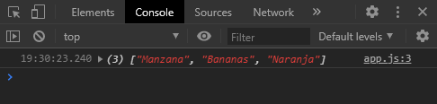
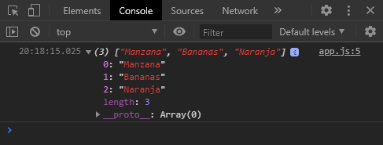
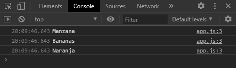
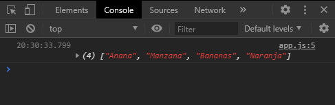
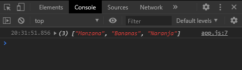
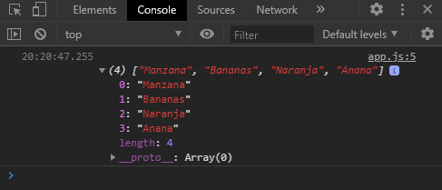
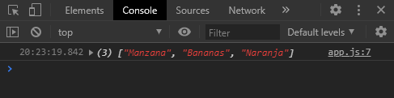

- [1. Resumen Javascript](#1-resumen-javascript)
  - [1.1. ¿Cómo hacer el link entre el .js y el .html?](#11-cómo-hacer-el-link-entre-el-js-y-el-html)
  - [1.2. Valores literales y variables](#12-valores-literales-y-variables)
    - [1.2.1. Literales](#121-literales)
    - [1.2.2. Variables](#122-variables)
      - [1.2.2.1. El Operador de Asignación "="](#1221-el-operador-de-asignación-)
  - [1.3. Consola](#13-consola)
  - [1.4. Tipos de Datos](#14-tipos-de-datos)
    - [1.4.1. Primitivos](#141-primitivos)
    - [1.4.2. Objeto](#142-objeto)
    - [1.4.3. ¿Cómo saber el tipo de dato de una variable?](#143-cómo-saber-el-tipo-de-dato-de-una-variable)
  - [1.5. Operadores Aritméticos](#15-operadores-aritméticos)
  - [1.6. Operadores de Comparación](#16-operadores-de-comparación)
  - [1.7. Conectores](#17-conectores)
  - [1.8. Arrays](#18-arrays)
    - [1.8.1. Métodos del Array](#181-métodos-del-array)
      - [1.8.1.1. ¿Cómo obtener el tamaño de un array?](#1811-cómo-obtener-el-tamaño-de-un-array)
      - [1.8.1.2. ¿Cómo recorrer un array / loop sobre un array?](#1812-cómo-recorrer-un-array--loop-sobre-un-array)
      - [Añadir un elemento al principio del array](#añadir-un-elemento-al-principio-del-array)
      - [Eliminar un elemento al principio del array](#eliminar-un-elemento-al-principio-del-array)
      - [Añadir un elemento al final del array](#añadir-un-elemento-al-final-del-array)
      - [Eliminar un elemento al final del array](#eliminar-un-elemento-al-final-del-array)
      - [¿Cómo saber la posición de un elemento en el array?](#cómo-saber-la-posición-de-un-elemento-en-el-array)
    - [.splice()](#splice)
  - [1.9. Condicionales](#19-condicionales)
    - [1.9.1. if](#191-if)
    - [1.9.2. if...else](#192-ifelse)
    - [1.9.3. if…else if](#193-ifelse-if)
    - [1.9.4. switch](#194-switch)
  - [1.10. Loops / Bucles](#110-loops--bucles)
    - [1.10.1. for](#1101-for)
    - [1.10.2. while](#1102-while)
    - [1.10.3. do while](#1103-do-while)

# 1. Resumen Javascript

## 1.1. ¿Cómo hacer el link entre el .js y el .html?
El link se hace con la siguiente sentencia.
```
<script src="linkATuScrips.js"></script>
```
Una buena práctica es colocarlo debajo del body.

## 1.2. Valores literales y variables

### 1.2.1. Literales
Los literales son valores, como indica su nombre, literales. Algunos ejemplos son números o cadenas de caractéres / palabras (llamadas `strings` mas adelante):

- 15
- 13.08
- "hola, ¿todo bien?"

### 1.2.2. Variables
Las variables se utilizan para alojar valores dentro de ellas y poder manipularlos a lo largo del programa.  

- `var` crea una variable global, puede re-asignarse y puede no asignarse un valor (a.k.a crearse vacía).
-  `let` crea una variable local, puede re-asignarse y puede no asignarse un valor (a.k.a crearse vacía).
-  `const` es una variable local, pero es constante, lo que significa que debe asignarse un valor si o si al ser creada y no puede ser reasignada bajo ninguna circunstancia en el resto del 
programa.

#### 1.2.2.1. El Operador de Asignación "="
El signo igual `=` en Javascript se utiliza para asignar un valor a una variable:

```
var x = 5;
```
Asigna el valor `5` a la variable `x`. Entonces si viesemos el contenido de `x`, sería `5`.

## 1.3. Consola
Según [MDN web docs](https://developer.mozilla.org/es/docs/Tools/Web_Console "Consola Web") la consola web:
1. Muestra la informacion asociada con los Logs de la pagina Web: cualquier solicitud de red, JavaScript, CSS, y errores de seguridad y advertencias, asi como tambien, advertencias, mensajes informativos explicitamente generados por Javascript en tiempo de ejecucion dentro del contexto de la pagina.
2. te permite interactuar con la pagina ejecutando expresiones Javascript en el contexto de la página.

La manera de interactuar con ésta es a través del método `console.log()` siguiendo el ejemplo anterior:

```
var x = 5;
console.log(x)
```

Una vez tenemos abierto nuestro HTML en el navegador podemos acceder a ella de la siguiente manera:

 En Chrome la manera rápida es apretando la tecla **F12** Y clickeando la segunda solapa llamada _"Console"_.

En nuestro caso, debido al ejemplo anterior, veremos el valor **5** impreso en ella.


## 1.4. Tipos de Datos
### 1.4.1. Primitivos
- **Undefined**: Cuando se crea una variable pero no se le asigna un valor.
```
var variableUndefined
```
- **Null**: El "null" o nulo es directamente un tipo de dato en sí mismo.
```
var variableNula = null
```
- **String**: Una cadena de caracteres alfanuméricos. Se define entre comillas.
```
var variableCadena = "Hola, todo bien? Tengo 22 años."
```
- **Number**: Numeros enteros
```
var variableNumero = 16
```
- **Boolean**: El "null" es directamente un tipo de dato en sí mismo. Tiene solo dos valores: _verdadero_ y _falso_. Sirve para cuando se necesiten variables donde los valores deban ser _SI_ / _NO_ - _ON_ / _OFF_ - _TRUE_ / _FALSE_.
```
var variableBooleanaVerdadera = true
```
```
var variableBooleanaFalsa = false
```

### 1.4.2. Objeto
El objeto es un tipo de variable que se inicializa con un nombre y una coleccion de propiedades, las cuales pueden ser modificadas, agregar nuevas y eliminar ya existentes.
Mas adelante en el resumen veremos como acceder a las propiedades y más información sobre los objetos. 

Existen dos maneras de crear un objeto en JS. 
```
var person = new Object();
persona.nombre = "John";
persona.apellido = "Doe";
persona.edad = 50;
persona.colorDeOjos = "azul";
```
```
var persona = {
    nombre:"John",
    apellido:"Doe",
    edad:50,
    colorDeOjos:"azul"};
```

También se puede crear vacío de la siguiente manera
```
var persona = {};
```
### 1.4.3. ¿Cómo saber el tipo de dato de una variable?
Con el método `typeof` o `typeOf()` de la siguientes dos maneras
```
console.log(typeOf(variable))
```
```
console.log(typeOf variable)
```

Por ejemplo creamos una variable con un **string** dentro llamada `miNombre`:
```
var miNombre = "Anto"
console.log(miNombre)
console.log(typeof(miNombre))
```


Como se observa en la consola, el tipo de dato es `string`

También se puede consultar un dato literal, por ejemplo:
```
console.log(typeOf (42))
```


Como se observa en la consola, el tipo de dato es `number`

**A tener en cuenta:**
- JavaScript trata string vacios `("")`, al `0` , `undefined` y `null` como `false`. Todo el resto es `true`.

## 1.5. Operadores Aritméticos
- ( `-` ) resta
- ( `+` ) suma
- ( `*` ) multiplicación
- ( `/` ) división (cociente)
- ( `%` ) módulo (resto de una división)

**DATO**: Para hacer una operación y una asignación a la vez se pueden usar los siguientes operadores:

- `+=`
- `-=`
- `*=`
- `/=`

Entonces:

```
var i = i + 1
```

es igual a:

```
var i += 1
```

## 1.6. Operadores de Comparación

En ocaciones precisamos de operadores que nos permitan comparar entre una variable y otra, o un valor en especifico y una variable. 

Las preguntas devulven un valor booleano (`true` o `false`) Es cuando entran los siguientes:

- ( `==` ) Devuelve verdadero si son iguales
 
- ( `===` ) Devuelve verdadero si los operandos son iguales y del mismo tipo.
  
- ( `!=` ) Devuelve verdadero si no son iguales

- ( `!==` ) Devuelve verdadero si los operandos no son iguales y / o no del mismo tipo
 
- ( `!` ) Negación
 
- ( `<` ) Menor que
 
- ( `>` ) Mayor que
 
- ( `<=` ) Menor o igual que
 
- ( `>=` ) Mayor o igual que

## 1.7. Conectores
Ya aprendimos como comparar dos variables, pero a veces precisamos hacer preguntas mas extensas y comparar más valores, por ejemplo:

¿Es la variable `x > 18` **Y** `x < 30`?

Lo que quiere decir: ¿Es `x` mayor que 18 **Y** menor que 30?

Para ésto nos ayudamos con los siguientes operadores, los cuales también devuelven un valor booleano. 

 - ( `||` ) significa ‘O’, da verdadero cuando se cumple alguna de todas las condiciones unidas por este conector. 

 - ( `&&` ) significa ‘Y’ da verdadero cuando todas las condiciones unidas por éste se cumplen.

## 1.8. Arrays
Son una clase de tipo lista. Alojan multiples variables. Tienen métodos propios para poder recorrerlas, agregar, quitar o modificar elementos. Su creación se realiza de la siguiente manera:

```
let Frutas = ["Manzana", "Bananas", "Naranja"]
```

Si quisieramos ver los elementos dentro del array, podríamos utlizando un `console.log(Frutas)` y el output sería el siguiente:



Como observamos, se puede ver la cantidad de elementos que tiene encerrados entre paréntesis al principio **_(3)_** y los tres elementos con los que fue creado.

Si quisieramos ver un elemento en específico del array la sentencia es la siguiente:

```
console.log ( Frutas[posición del elemento] )
```
Las posiciones en un array comienzan desde el **0** por lo que en nuestro ejemplo:

``Frutas[0]`` corresponde a ``"Manzanas"``

``Frutas[1]`` corresponde a ``"Bananas"``

``Frutas[2]`` corresponde a ``"Naranja``

Sin emabargo, como observamos anteriormente, la cantidad de elementos dentro del array, se cuenta desde el **1**. Por eso nuestro array tiene **(3)**.



Si expandimos la línea podemos ver el tamaño **(3)**. Y debajo en que posición se encuentra cada elemento.

Si quisieramos podríamos crear un array vacío de la siguiente manera:

```
let Frutas = []
```

### 1.8.1. Métodos del Array
#### 1.8.1.1. ¿Cómo obtener el tamaño de un array?

Con el método `.length` de la siguiente manera:
```
let largoDeArray = Frutas.length
console.log(largoDeArray)
```
// Output esperado: **3**

Con éste método también se puede acceder a la última posición de un array el cuál no sabemos el largo, sin la necesidad de consultarlo antes:

```
let ultimoElemento = Frutas[Frutas.length - 1]
console.log(ultimoElemento)
```
// Output esperado: **Naranja**

Con `Frutas[]` estamos llamando al array que creamos previamente, con ``Frutas.lenght`` consultamos el largo del array.
El `-1` lo que hace es acceder a la última posición, ya que como vimos, las posiciones del array empiezan desde `0`, pero el largo empieza a contar desde `1`.

Entonces ``Frutas[Frutas.length]`` es lo mismo que `Frutas[3]` la cuál no existe en nuestro array `Frutas`, necesitamos restarle esa posición con el `-1` para que acceda a ``Frutas[2]`` que sí es nuestra última posición.

#### 1.8.1.2. ¿Cómo recorrer un array / loop sobre un array?
Con el método `forEach` 

```
Frutas.forEach(elemento => console.log(elemento))
```
Nuestro output:



Con `Frutas` hacemos referencia al array. Con `.forEach(variable)` decimos **cada elemento que haya dentro del array metelo en una variable** a la cuál nombramos nosotros, en el ejemplo anterior le pusimos `elemento` de nombre a nuestra variable. Y con la flecha `=>` indicamos que **por cada elemento alojado en la variable que creamos ejecutamos el código que esté después de ella**. En nuestro caso, un `console.log(elemento)` de cada elemento de nuestro array.

Si hubiesemos puesto

```
Frutas.forEach(x => console.log(x))
```

Funciona de la misma manera. 

**DATO:** La variable existe **SOLO** dentro de los paréntesis, es local.

#### Añadir un elemento al principio del array
Con ``.unshift(elemento)``

```
Frutas.unshift("Anana")

console.log(Frutas)
```


Y ahora el elemento **"Anana"** existe en nuestro ``array`` en la posición ``Frutas[0]``. Y nuestro array tiene `length` de **(4)**

#### Eliminar un elemento al principio del array
Con ``.shift()``

```
Frutas.shift()

console.log(Frutas)
```


Y ahora el elemento **"Anana"** no existe en nuestro ``array``.

#### Añadir un elemento al final del array
Con `.push(elemento)`

```
Frutas.push("Anana")

console.log(Frutas)
```


Y ahora el elemento **"Anana"** existe en nuestro ``array`` en la posición ``Frutas[3]``. Y nuestro array tiene `length` de **(4)**

#### Eliminar un elemento al final del array

Con `.pop()`

```
Frutas.pop()

console.log(Frutas)
```


Y ahora el elemento **"Anana"** que metimos último, no existe en nuestro ``array``.

#### ¿Cómo saber la posición de un elemento en el array?
Con ``.indexOf(Elemento)``

```
let posicion = Frutas.indexOf("Manzana")
console.log(posicion)
```
// Output esperado: **0**

### .splice()
El método `splice()` se puede utilizar para insertar un elemento en una posición específica. Para reemplazar un elemento por otro. Para eliminar un elemento en una posición específica, etc.

```
Frutas.splice(1, 0, 'Anana');
```

## 1.9. Condicionales

### 1.9.1. if

Para realizar las preguntas de las que venimos hablando anteriormente en Conectores y Operadores de Comparación existe una función llamada `if`. Es una función de decisión, realiza una pregunta y si es verdadera se ejecuta el primer bloque de código inmediato que especifiquemos debajo.

La sintaxis es:
```
if(condicion) {
	valor verdadero;
}
```

Ejemplo: Hacer un programa que, según una variable `edad`, determine si la persona es mayor o no, y lo imprima por consola.

```
var edad = 25

if(edad > 18){
    console.log("Es mayor de edad")  //codigo que se ejecuta si la pregunta es verdadera
}
```


### 1.9.2. if...else

Pero ¿Qué pasa si la edad pasa a ser 17, por ejemplo?

En nuestro caso anterior no sucede nada, porque no especificamos código en caso de que la consulta sea falsa, para eso existe el `if...else` :

```
var edad = 17

if(edad > 18){

    console.log("Es mayor de edad") //codigo que se ejecuta si la pregunta es verdadera

} else {

    console.log("Es menor de edad") //codigo que se ejecuta si la pregunta es falsa

}
```

Entonces, ahora sí veríamos en consola el mensaje _"Es menor de edad"_, ya que 17 no es mayor a 18, por lo que la sentencia es falsa entonces saldría por la parte falsa de la pregunta: el `else`.


### 1.9.3. if…else if
En ocasiones necesitamos tener varias preguntas para la misma variable. 

Por ejemplo: crearemos un programa que nos diga si el color alojado en la variable `color` es primario o no.

```
var color = amarillo


if(color === 'rojo'){

    console.log("Es color primario")

} else if (color === 'azul'){

    console.log("Es color primario")
    
} else if (color === 'amarillo'){

    console.log("Es color primario")

} else {

    console.log("No es color primario")
}
```

El recorrido que hace es el siguiente: 

1. Primero compara la variable `color` con 'rojo', en caso de ser falso realiza la segunda pregunta
2. ¿la variable `color` contiene el valor 'azul'? en caso de ser falso (que en nuestro caso lo es), continúa con la siguiente pregunta,
3. ¿la variable `color` contiene el valor 'amarillo'? es verdadera entonces se ejecutaría el código que especificamos dentro de las llaves.

En caso de que ningun `else if` sea verdadero, entonces se considera falso y se ejecuta el código especificado en `else`. 

**DATO:** No es obligatorio especificar un `else`.

Otra manera de preguntar lo mismo es utilizando los Operadores de comparación, los cuales nos ahorran un par de líneas de código, de la siguiente manera:


```
var color = amarillo


if(color === 'rojo' || color === 'azul' || color === 'amarillo'){

    console.log("Es color primario")

} else {

    console.log("No es color primario")
}
```
Lo que en realidad estamos preguntando es:

¿La variable `color` es rojo **O** azul **O** amarillo?
Entonces, si una de las tres es verdadera, la pregunta o condición se da por verdadera y veríamos en la consola _"Es color primario"_. En caso contrario, si no fuese ninguna de las tres, entonces saldría por el `else`.

Distinto sería si nosotros preguntásemos con el operador `&&` de la siguiente manera:

```
if(color === 'rojo' && color === 'azul' && color === 'amarillo')
```

Esto en nuestro ejemplo no tiene mucho sentido, ya que lo que estaría preguntando es: 

¿La variable `color` es rojo, azul **Y** amarillo a la vez?
Ya que para ser considerada verdadera la condición deben cumplirse las tres preguntas a la vez, por estar unidas con el operador llamado `AND` o `Y` o `&&`.  

### 1.9.4. switch
A veces al tener una gran cantidad de opciones, la sintaxis del `if..else if` resulta engorrosa, ahí es cuando es de ayuda el `switch`.

La sintaxis es la siguiente:

```
var opcionCajero= 'Pago Servicios'

switch(opcionCajero){

    case 'Pago Servicios':
        //codigo que se ejecuta en caso de que la variable opcionCajero sea 'Pago Servicios'
        break;

    case 'Ver Saldo':
        //codigo que se ejecuta en caso de que la variable opcionCajero sea 'Ver Saldo'
        break;

    case 'Pago Tarjeta':
        //codigo que se ejecuta en caso de que la variable opcionCajero sea 'Pago Tarjeta'
        break;

    case 'Transferencia':
        //codigo que se ejecuta en caso de que la variable opcionCajero sea 'Transferencia'
        break;

    default:
        //codigo que se ejecuta en caso de que todas las anteriores hayan sido falsas.
        break;
}
```
En este ejemplo se simulan las opciones de un cajero automático. 
Cada opción o `case` se identifica en un renglon, seguido de dos puntos ( `:` ), debajo el código que se ejecutará en caso de que la variable tenga ese valor, y debajo la sentencia `break` la cuál hace que el switch acabe ahí y no siga preguntando por las demás opciones.

También cuenta con una opción con la misma funcionalidad del `else` llamada `default`. En caso de que las opciones anteriores no hayan sido verdaderas, entonces ejecuta el código especificado debajo. 

**DATO:** Al igual que en el `else` en el `for` no es obligatorio utilizar el `default` en el `switch`.

## 1.10. Loops / Bucles
Los loops se utilizan cuando necesitamos que determinado bloque de código se ejecute varias veces sin la necesidad de escribir una y otra vez las mismas líneas de código.

### 1.10.1. for
Cuando sabemos la cantidad de veces que se ejecutará el bloque de código podemos utilizar el `for`. Vamos a repasar la sintaxis con un ejemplo:

Realicemos un programa que cuente del 0 al 10.
Sin el ``for`` probablemente realizariamos algo así:

```
let i = 0;

i = i + 1;
i = i + 1;
i = i + 1;
i = i + 1;
i = i + 1;
i = i + 1;
i = i + 1;
i = i + 1;
i = i + 1;
i = i + 1;

console.log(i);
```

//Output esperado: **10**

Con un `for` la sintaxis sería la siguiente:

```
for(let i = 0; i <= 10 ; i++){
    console.log(i)
}
```
Entonces en el primer espacio creariamos la variable `i`  la cual inicializa en 0 (en nuestro ejemplo, puede inicializarse en cualquier otro número, o en una variable incluso por ejemplo ``let i=edad``)

En el segundo espacio luego del ( `;` ) se coloca la condición. Nuestro ejemplo lo que quiere decir es que el bloque se ejecutará siempre y cuando la variable `i` que creamos anteriormente sea igual o menor a 10.

En el tercer espacio luego del segundo ( `;` ) se coloca la manera en la que va a ir sumando la variable `i`

**DATO:** El `i++` es lo mismo que hacer `i = i + 1` suma uno a la vez.

Así nos aseguramos que el bloque de código - _en nuestro caso un console.log(i)_ - se ejecute 11 veces (sumando del 0 al 11)

**A tener en cuenta:**
- Si la variable `i` es creada dentro del `for` como hicimos en nuestro caso, entonces esta es **local**, lo que quiere decir que se puede utilizar solo dentro del for, si intentamos utilizarla fuera, nos va a dar un error la consola.

    Si ejecutamos el mismo código de ejemplo pero agregandole una línea por fuera del for que realice un `console.log(i)` :

```
for (let i = 0 ; i<=10 ; i++){
    console.log(i)
}

console.log(i)
```

Nuestro output se verá de la siguiente manera: 


Observamos que la variable `i` existe dentro del `for` por las 11 impresiones de ésta en la consola. Pero cuando queremos imprimirla por fuera, nos dice que "`i` no está definida". Porque como dijimos anteriormente, es una variable **local**.

- Es distinto cuando la variable la creamos por fuera del for, de la siguiente manera:

```
let i

for (i = 0 ; i<=10 ; i++){
    console.log(i)
}

console.log("la variable i contiene el numero: ")
console.log(i)
```
 Nuestra consola va a mostrar lo siguiente:


Donde podemos ver que la variable existe dentro y fuera del `for`.

**DATO:** La variable `i` por fuera del `for` muestra el número 11 y no 10 porque antes de "entrar" a hacer de nuevo el loop, en cada ejecución lo que hace es aumenta `i` en el valor que nosotros hayamos puesto de antemano _(en nuestro ejemplo `i++`)_ y ahí realiza la consulta _(en nuestro ejemplo `i <= 10`)_, como 11 no es <= 10 sale del `for`, pero a `i` lo deja aumentado.

### 1.10.2. while

Si precisamos que un bloque de código se ejecute una indeterminada cantidad de veces podemos utilizar el `while`. La traducción literal al español es "mientras", y funciona de la siguiente manera:

```
while(condición){

    //codigo que se ejecuta mientras la condición sea verdadera

}
```

Utilizando el mismo ejemplo de sumar de 0 a 10, el código sería el siguiente:

```
let i = 0

while(i <= 10){
    i+=1 //es lo mismo que colocar i = i + 1
    console.log(i)
}
```
Se ejecutará el código siempre y cuando i sea menor o igual que 10. Y el resultado en la consola sería el mismo que para el `for`.

**A tener en cuenta:** 
- En el caso del `while` la variable deberá ser creada e inicializada fuera. Si lo intentamos crear dentro, dará error.
- No entrará al ciclo ninguna vez si la condición no es verdadera.

### 1.10.3. do while
El ciclo `do while` es igual que el `while` con una diferencia:

**El código siempre se ejecuta como mínimo una vez** ya que primero se ejecuta el bloque y luego se evalúa la condición por primera vez.
En caso de que diese falso, continúa, si la condición es verdadera, vuelve a ejecutar el código.

La sintaxis es la sigiente:

```
do {
  //código a ejecutar la primera vez si o si, y luego se ejecuta si la condición es verdadera
} while (condición);
```

