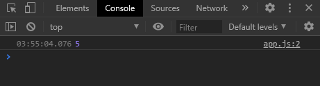
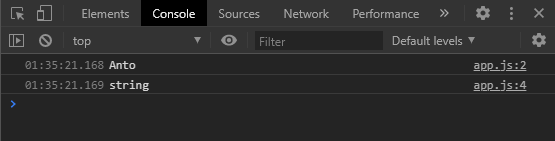
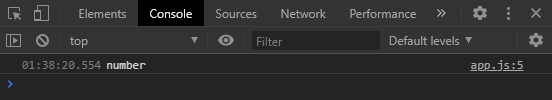
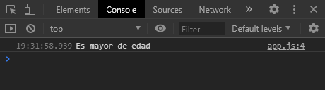
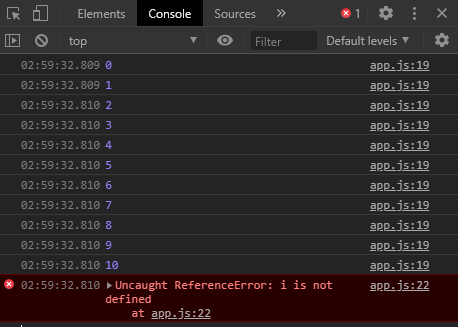
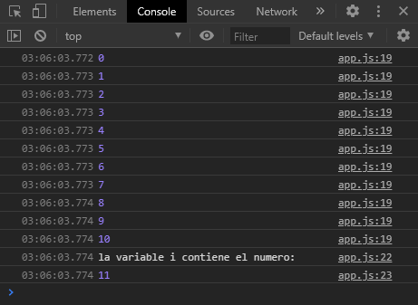

# Resumen Javascript

## Variables
- `var` crea una variable global, puede re-asignarse y puede no asignarse un valor (a.k.a crearse vacía).
-  `let` crea una variable local, puede re-asignarse y puede no asignarse un valor (a.k.a crearse vacía).
-  `const` es una variable local, pero es constante, lo que significa que debe asignarse un valor si o si al ser creada y no puede ser reasignada bajo ninguna circunstancia en el resto del 
programa.


## Consola
Según [MDN web docs](https://developer.mozilla.org/es/docs/Tools/Web_Console "Consola Web") la consola web:
1. Muestra la informacion asociada con los Logs de la pagina Web: cualquier solicitud de red, JavaScript, CSS, y errores de seguridad y advertencias, asi como tambien, advertencias, mensajes informativos explicitamente generados por Javascript en tiempo de ejecucion dentro del contexto de la pagina.
2. te permite interactuar con la pagina ejecutando expresiones Javascript en el contexto de la página.

La manera de interactuar con ésta es a través del método `console.log()` por ejemplo

```
var miNombre = "Anto"
console.log(miNombre)
```

Una vez tenemos abierto nuestro html en el navegador podemos acceder a ella. En Chrome la manera rápida es apretando la tecla **F12**. La segunda solapa que encontraremos es _"Console"_.

En nuestro caso, debido al ejemplo anterior, veremos el valor **"Anto"** impreso en ella.



## El Operador de Asignación "="
El signo igual `=` en Javascript se utiliza para asignar el valor de una variable a la variable en si.

```
var x = 5 + 4;
```
Asigna el valor que resulta de la suma de `5 + 4` a la variable `x`. Entonces si hacemos un print de pantalla

## Tipos de Datos
### Primitivos
- **Undefined**: Cuando se crea una variable pero no se le asigna un dato.
```
var variableUndefined
```
- **Null**: El "null" es directamente un tipo de dato en sí mismo.
```
var variableNula = null
```
- **String**: Una cadena de caracteres alfanuméricos. Se define entre comillas.
```
var variableCadena = "Hola, todo bien? Tengo 22 años."
```
- **Number**: Numeros enteros
```
var variableNumero = 16
```
- **Boolean**: El "null" es directamente un tipo de dato en sí mismo. Tiene solo dos valores: _verdadero_ y _falso_. Sirve para cuando se necesiten variables donde los valores deban ser _SI_ / _NO_ - _ON_ / _OFF_ - _TRUE_ / _FALSE_.
```
var variableBooleanaVerdadera = true
```
```
var variableBooleanaFalsa = false
```
- **Number**: Numeros enteros
```
var variableNumero = 16
```

### Tipo Objeto
El objeto es un tipo de variable que se inicializa con un nombre y una coleccion de propiedades, las cuales pueden ser modificadas, agregar nuevas y eliminar ya existentes.
Mas adelante en el resumen veremos como acceder a las propiedades y más información sobre los objetos. 

Existen dos maneras de crear un objeto en JS. 
```
var person = new Object();
persona.nombre = "John";
persona.apellido = "Doe";
persona.edad = 50;
persona.colorDeOjos = "azul";
```
```
var persona = {
    nombre:"John",
    apellido:"Doe",
    edad:50,
    colorDeOjos:"azul"};
```

También se puede crear vacío de la siguiente manera
```
var persona = {};
```
### ¿Cómo saber el tipo de dato de una variable?
Con el método `typeof` o `typeOf()` de la siguientes dos maneras
```
console.log(typeOf(variable))
```
```
console.log(typeOf variable)
```

Siguiendo con el ejemplo de la variable `miNombre`:
```
var miNombre = "Anto"
console.log(miNombre)
console.log(typeof(miNombre))
```


Como se observa en la consola, el tipo de dato es `string`

También se puede consultar un tipo de dato de manera literal, por ejemplo:
```
console.log(typeOf (42))
```



Como se observa en la consola, el tipo de dato es `number`

### Cosas a tener en cuenta sobre tipos de datos
- JavaScript trata string vacios `("")`, al `0` , `undefined` y `null` como `false`. Todo el resto es `true`.

## Operadores Aritméticos
- ( `-` ) resta
- ( `+` ) suma
- ( `*` ) multiplicación
- ( `/` ) división (cociente)
- ( `%` ) módulo (resto de una división)

**TIP**: Para hacer una operación y una asignación a la vez se pueden usar los siguientes operadores:

- `+=`
- `-=`
- `*=`
- `/=`

Entonces:

```
var i = i + 1
```

es igual a hacer

```
var i += 1
```

## Operadores de Comparación

En ocaciones precisamos de operadores que nos permitan comparar entre una variable y otra, o un valor en especifico y una variable. 

Las preguntas devulven un valor booleano (`true` o `false`) Es cuando entran los siguientes:

- ( `==` ) Devuelve verdadero si son iguales
 
- ( `===` ) Devuelve verdadero si los operandos son iguales y del mismo tipo.
  
- ( `!=` ) Devuelve verdadero si no son iguales

- ( `!==` ) Devuelve verdadero si los operandos no son iguales y / o no del mismo tipo
 
- ( `!` ) Negación
 
- ( `<` ) Menor que
 
- ( `>` ) Mayor que
 
- ( `<=` ) Menor o igual que
 
- ( `>=` ) Mayor o igual que

## Conectores
Ya aprendimos como comparar dos variables, pero a veces precisamos hacer preguntas mas extensas y comparar más valores, por ejemplo:

¿Es la variable `x > 18` **Y** `x < 30`?

Lo que quiere decir: ¿Es `x` mayor que 18 **Y** menor que 30?

Para ésto nos ayudamos con los siguientes operadores, los cuales también devuelven un valor booleano. 

 - ( `||` ) significa ‘O’, da verdadero cuando se cumple alguna de todas las condiciones unidas por este conector. 

 - ( `&&` ) significa ‘Y’ da verdadero cuando todas las condiciones unidas por éste se cumplen.

## Condicionales

### IF

Para realizar las preguntas de las que venimos hablando anteriormente en Conectores y Operadores de Comparación existe una función llamada `if`. Es una función de decisión, realiza una pregunta y si es verdadera se ejecuta el primer bloque de código inmediato que especifiquemos debajo.

La sintaxis es:
```
if(condicion) {
	valor verdadero;
}
```

Ejemplo: Hacer un programa que, según una variable `edad`, determine si es mayor o no, y lo imprima por consola.

```
var edad = 25

if(edad > 18){
    console.log("Es mayor de edad")  //codigo que se ejecuta si la pregunta es verdadera
}
```


### IF...ELSE

Pero ¿qué pasa si la edad pasa a ser 17, por ejemplo?

En este caso no sucede nada, porque la parte que saldría por "falso" no está especificada, para eso existe el `if...else`

```
var edad = 17

if(edad > 18){
    console.log("Es mayor de edad") //codigo que se ejecuta si la pregunta es verdadera
} else {
    console.log("Es menor de edad") //codigo que se ejecuta si la pregunta es falsa
}
```

Entonces, ahora sí veríamos en consola el mensaje "Es menor de edad", ya que 17 no es mayor a 18, por lo que la sentencia es falsa entonces saldría por la parte falsa de la pregunta: el else.


### IF…ELSE IF
En ocasiones necesitamos tener varias opciones de preguntas. 

Por ejemplo: crearemos un programa que nos diga si el color que entran por variable son primarios o no.

```
var color = amarillo


if(color === 'rojo'){

    console.log("Es color primario")

} else if (color === 'azul'){

    console.log("Es color primario")
    
} else if (color === 'amarillo'){

    console.log("Es color primario")

} else {

    console.log("No es color primario")
}
```

El recorrido que hace es el siguiente: primero compara la variable `color` con 'rojo', en caso de ser falso realiza la segunda pregunta, ¿la variable `color` contiene el valor 'azul'? en caso de ser falso (que en nuestro caso lo es), continúa con la siguiente pregunta, que sería verdadera y se ejecutaría el código que especificamos dentro de las llaves.
En caso de que ningun `else if` sea verdadero, entonces se considera falso y se ejecuta el código especificado en `else`. 

No es obligatorio especificar un `else`.

Otra manera de preguntar lo mismo es utilizando los Operadores de comparación, los cuales nos ahorran un par de líneas de código, de la siguiente manera:


```
var color = amarillo


if(color === 'rojo' || color === 'azul' || color === 'amarillo'){

    console.log("Es color primario")

} else {

    console.log("No es color primario")
}
```
Lo que en realidad estamos preguntando es:

¿La variable `color` es rojo **O** azul **O** amarillo?
Entonces, si una de las tres es verdadera, la pregunta o condición se da por verdadera y veríamos en la consola "Es color primario" En caso contrario, si no fuese ninguna de las tres, entonces saldría por el ELSE.

Distinto sería si nosotros preguntásemos con el operador `&&` de la siguiente manera

```
if(color === 'rojo' && color === 'azul' && color === 'amarillo')
```

Esto en nuestro ejemplo no tiene mucho sentido, ya que lo que estaría preguntando es: 

¿La variable `color` es rojo, azul y amarillo a la vez?
Ya que para ser considerada verdadera la condición deben cumplirse las tres, por estar unidas con el operador llamado `AND` o `Y` o `&&`.  

### SWITCH
A veces al tener una gran cantidad de opciones, la sintaxis del `if..else if` resulta engorrosa, ahí es cuando es de ayuda el `switch`.

La sintaxis es la siguiente:

```
var opcionCajero= 'Pago Servicios'

switch(opcionCajero){
    case 'Pago Servicios':
        //codigo que se ejecuta en caso de que la variable opcionCajero sea 'Pago Servicios'
        break;

    case 'Ver Saldo':
        //codigo que se ejecuta en caso de que la variable opcionCajero sea 'Ver Saldo'
        break;

    case 'Pago Tarjeta':
        //codigo que se ejecuta en caso de que la variable opcionCajero sea 'Pago Tarjeta'
        break;

    case 'Transferencia':
        //codigo que se ejecuta en caso de que la variable opcionCajero sea 'Transferencia'
        break;

    default:
        //codigo que se ejecuta en caso de que todas las anteriores hayan sido falsas.
        break;
}
```
En este ejemplo se simulan las opciones de un cajero automático. 
Cada opción o `case` se identifica en un renglon, seguido de dos puntos ( `:` ), debajo el código que se ejecutará en caso de que la variable tenga ese valor, y debajo la sentencia `break` la cuál hace que el switch acabe ahí y no siga preguntando por las demás opciones.

También cuenta con una opción con la misma funcionalidad del `else` llamada `default`. En caso de que las opciones anteriores no hayan sido verdaderas, entonces ejecuta el código especificado debajo. No es obligatorio utilizarlo.

## LOOP
Los loops se utilizan cuando necesitamos que determinado bloque de código se ejecute varias veces sin la necesidad de escribir una y otra vez las líneas de código.

### for
Cuando sabemos la cantidad de veces que se ejecutará el bloque de código podemos utilizar el `for`. Vamos a repasar la sintaxis con un ejemplo:

Realicemos un programa que cuente del 0 al 10.
Sin el for probablemente realizariamos algo así:

```
let i = 0

i = i + 1
i = i + 1
i = i + 1
i = i + 1
i = i + 1
i = i + 1
i = i + 1
i = i + 1
i = i + 1
i = i + 1

console.log(i)
```

//Output esperado: 10

Con un `for` la sintaxis sería la siguiente

```
for(let i = 1 ; i <= 10 ; i++){
    console.log(i)
}
```
Entonces en el primer espacio creariamos la variable `i`  la cual inicializa en 1 (en nuestro ejemplo, puede inicializarse en cualquier otro numero, o en una variable)

En el segundo espacio luego del ( `;` ) se coloca la condición, lo que quiere decir es que los bloques se ejecutarán siempre y cuando la variable `i` que creamos anteriormente sea igual o menor a 10.

En el tercer espacio luego del segundo ( `;` ) se coloca la manera en la que va a ir sumando la variable `i`

**DATO:** El `i++` es lo mismo que hacer `i = i + 1` suma uno a la vez.

Así nos aseguramos que el bloque de código - _en nuestro caso un console.log(i)_ - se ejecute 11 veces (sumando del 0 al 11)

**A tener en cuenta:**
- Si la variable `i` es creada dentro del `for` como hicimos en nuestro caso, entonces esta es **local**, lo que quiere decir que se puede utilizar solo dentro del for, si intentamos utilizarla fuera, nos va a dar un error la consola.

Si ejecutamos el mismo código de ejemplo pero agregandole una línea por fuera del for que realice un `console.log(i)` :

```
for (let i = 0 ; i<=10 ; i++){
    console.log(i)
}

console.log(i)
```

Nuestro output se verá de la siguiente manera: 



Observamos que la variable `i` existe dentro del `for` por las 11 impresiones de ésta en la consola. Pero cuando queremos imprimirla por fuera, nos dice que "`i` no está definida". Porque como dijimos anteriormente, es una variable **local**.

- Es distinto cuando la variable la creamos por fuera del for, de la siguiente manera:

```
let i

for (i = 0 ; i<=10 ; i++){
    console.log(i)
}

console.log("la variable i contiene el numero: ")
console.log(i)
```
Nuestra consola va a mostrar lo siguiente:



Donde podemos ver que la variable existe dentro y fuera del `for`.

**DATO:** La variable `i` por fuera del `for` muestra el número 11 y no 10 porque antes de entrar a hacer de nuevo el loop 

### while
